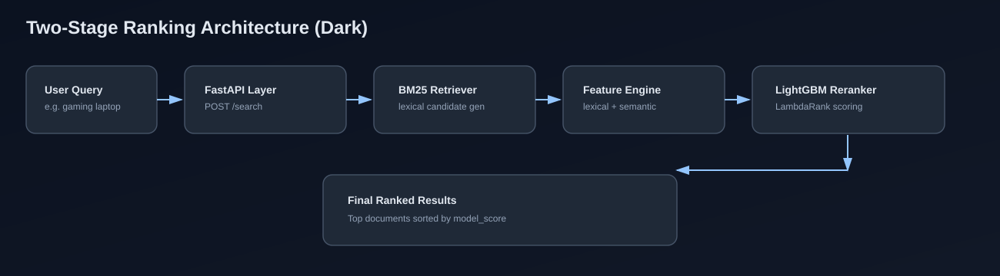
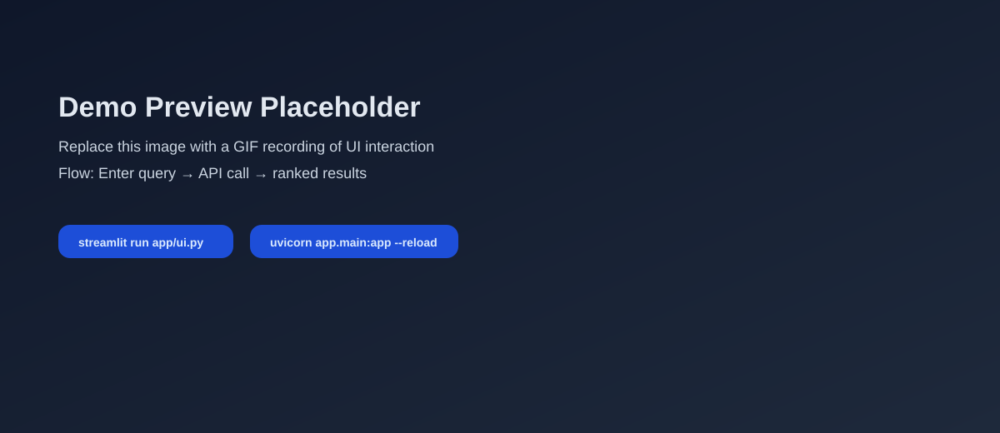
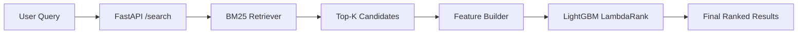
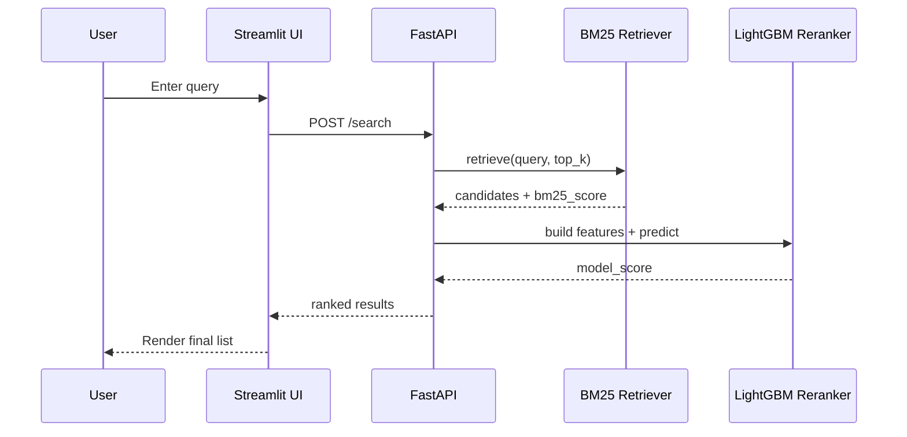
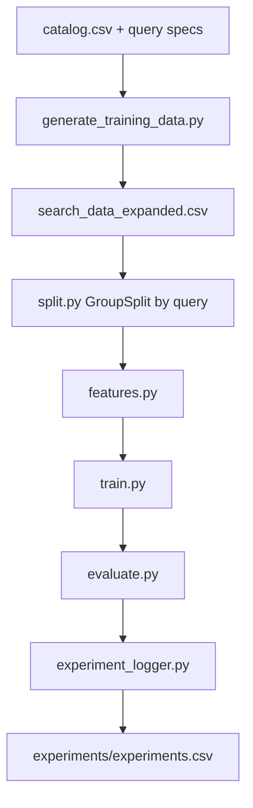

# Two-Stage Search Ranking System

<p align="center">
   
</p>

<p align="center">
   
   
   
   
   
</p>

Production-minded search intelligence pipeline where a user query is first matched lexically (BM25) and then reranked by a learning-to-rank model using lexical + semantic features.

## 30-Second Interview Pitch

I built a production-minded two-stage search ranking system where BM25 first retrieves top-K lexical candidates, then a LightGBM LambdaRank reranker reorders them using lexical and semantic features. The project includes hard-negative data generation, offline ranking evaluation with NDCG, MRR, MAP, experiment tracking, a FastAPI serving layer, a Streamlit demo UI, and Docker packaging.

## Table Of Contents

- [30-Second Interview Pitch](#30-second-interview-pitch)
- [Why This Project](#why-this-project)
- [Visual Architecture Gallery](#visual-architecture-gallery)
- [Demo Preview](#demo-preview)
- [Demo Recording Guide](#demo-recording-guide)
- [System Architecture](#system-architecture)
- [Request Lifecycle](#request-lifecycle)
- [Feature Stack](#feature-stack)
- [Results Snapshot](#results-snapshot)
- [Interactive Runbook](#interactive-runbook)
- [API Example](#api-example)
- [Experiment Tracking](#experiment-tracking)
- [Project Structure](#project-structure)
- [Large Public Dataset Training](#large-public-dataset-training)
- [Deployment Recommendation](#deployment-recommendation)
- [Roadmap](#roadmap)

## Why This Project

- Solves a real ranking problem using a scalable two-stage architecture.
- Uses hard negatives to improve model discrimination.
- Combines lexical and semantic relevance features.
- Includes evaluation, experiment logging, API serving, UI demo, and Docker packaging.

## Visual Architecture Gallery



## Demo Preview



Replace this placeholder with a short GIF once you record UI interaction.

## Demo Recording Guide

- Full checklist: [docs/demo-recording-checklist.md](docs/demo-recording-checklist.md)
- One-command launcher (PowerShell):

```powershell
powershell -ExecutionPolicy Bypass -File scripts/start-demo.ps1
```

- Auto-convert recorded MP4 to optimized GIF:

```powershell
powershell -ExecutionPolicy Bypass -File scripts/convert-demo-to-gif.ps1 -InputMp4 docs/assets/demo.mp4 -OutputGif docs/assets/demo.gif
```

- After recording, export GIF as `docs/assets/demo.gif` and replace the placeholder path in this README.

## System Architecture



## Request Lifecycle



## Feature Stack

| Group | Features |
|---|---|
| Lexical | `bm25_score`, `tfidf_cosine_sim`, `overlap_count`, `overlap_ratio`, `exact_match` |
| Structural | `query_len`, `doc_len` |
| Semantic | `semantic_cosine_sim` (Sentence Transformers) |

## Results Snapshot

Latest observed offline metrics from the held-out query split:

| Model | NDCG@5 | MRR | MAP |
|---|---:|---:|---:|
| BM25 Baseline | 0.8170 | 0.8333 | 0.7931 |
| BM25 + Reranker (Hybrid Features) | 0.9905 | 1.0000 | 0.9347 |

## Interactive Runbook

<details>
<summary><strong>1) Setup Environment</strong></summary>

```bash
pip install -r requirements.txt
```

</details>

<details>
<summary><strong>2) Generate Expanded Labeled Data (with hard negatives)</strong></summary>

```bash
python src/generate_training_data.py
```

</details>

<details>
<summary><strong>3) Train + Evaluate + Analyze</strong></summary>

```bash
python src/train.py
python src/evaluate.py
python src/analyze.py
```

</details>

<details>
<summary><strong>4) Run Inference Locally</strong></summary>

```bash
python src/predict.py
```

</details>

<details>
<summary><strong>5) Launch API</strong></summary>

```bash
uvicorn app.main:app --reload
```

Open: `http://127.0.0.1:8000/docs`

</details>

<details>
<summary><strong>6) Launch UI Demo</strong></summary>

```bash
streamlit run app/ui.py
```

</details>

<details>
<summary><strong>7) Docker Run</strong></summary>

```bash
docker build -t search-ranker .
docker run -p 8000:8000 search-ranker
```

</details>

## API Example

Request:

```json
{
   "query": "gaming laptop",
   "retrieve_top_k": 10
}
```

Response shape:

```json
{
   "query": "gaming laptop",
   "results": [
      {
         "doc_id": 3,
         "document": "lenovo legion gaming laptop",
         "category": "laptop",
         "bm25_score": 2.4467,
         "model_score": 7.9735
      }
   ]
}
```

## Experiment Tracking

- Experiment log: [experiments/experiments.csv](experiments/experiments.csv)
- Logger helper: [src/experiment_logger.py](src/experiment_logger.py)
- Ablation runner: [src/ablation.py](src/ablation.py)

Offline experiment pipeline:



## Project Structure

```text
search-ranking-model/
├── app/
│   ├── main.py
│   └── ui.py
├── data/
│   ├── raw/
│   └── processed/
├── experiments/
│   └── experiments.csv
├── models/
├── src/
│   ├── generate_training_data.py
│   ├── retrieve.py
│   ├── features.py
│   ├── train.py
│   ├── evaluate.py
│   ├── prepare_msmarco_large.py
│   ├── train_large.py
│   ├── analyze.py
│   ├── ablation.py
│   ├── experiment_logger.py
│   └── predict.py
├── Dockerfile
└── requirements.txt
```

## Large Public Dataset Training

This project now supports real large-scale public training data using **MS MARCO Passage Train** (8.8M docs, 808K queries).

### 1) Build large LTR pairs from MS MARCO

```bash
python src/prepare_msmarco_large.py --max-queries 800000 --hard-negatives 30
```

Output:

- `data/raw/msmarco_ltr_pairs.parquet`
- `data/raw/msmarco_ltr_stats.json`

### 2) Train large LambdaRank model

```bash
python src/train_large.py --pairs-path data/raw/msmarco_ltr_pairs.parquet
```

Output:

- `models/lgbm_ranker_large.pkl`
- `models/tfidf_vectorizer_large.pkl`
- `data/processed/train_featured_large.parquet`
- `data/processed/test_featured_large.parquet`

Note: This is intended for high-storage / high-memory environments due dataset size.

## Deployment Recommendation

**Can you publish on Vercel?**

- Vercel is good for frontend and lightweight serverless functions.
- For this ML API (large model artifacts, heavier CPU/RAM, longer requests), Vercel is usually not ideal.

Recommended production setup:

- Frontend/UI on Vercel (optional)
- FastAPI ranking API on one of: Render, Railway, Fly.io, Google Cloud Run, AWS ECS/Fargate
- Model/data artifacts in object storage (S3/GCS/R2)

If you need a single place, use Cloud Run or Render for the full API service.

## Roadmap

- Real user behavior labels (clicks, add-to-cart, purchase)
- Hard-negative mining from larger corpus
- Embedding cache for lower latency
- Experiment tracking with run IDs and config hashes
- CI pipeline for regression checks
